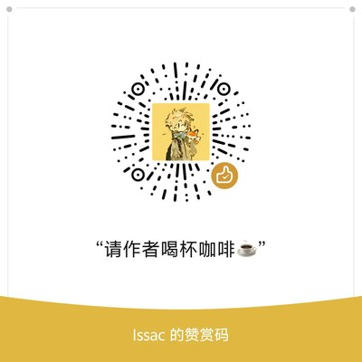

# ModelSmith — 数学建模竞赛求解 Skill

> **An AI agent skill** that turns ZCode / Claude Code into a math-modeling contest team — solve, verify, and deliver a competition paper as PDF.


一个装进 AI 编程助手的**数学建模竞赛求解技能**：确定性引擎打底、智能体自适应兜底、
命题人范式论文产出。支持 ZCode、Claude Code 等任何能加载 skills 的编程智能体。

给定一道数模赛题（CUMCM / MCM / ICM 均可），按五步工作流交付完整成果：
**读题分类 → 范例适配 → 确定性计算 → 结果验证 → 排版 PDF 论文**。
核心纪律只有一条：每个数字可溯源到代码真实输出，审计不过不交付。

## 和直接问 AI 有什么区别

| 直接问 AI | 装 ModelSmith |
|---|---|
| 数值可能是编的，没法核验 | 全部指标来自真实运行的代码，落盘 metrics.json + 物理区间自检 |
| 没有验证环节，错了不知道 | 沙箱执行 + 强弱零键检查 + 随机算法多种子 CV 闸门 + 第二方法交叉验证 |
| 论文一股 AI 味 | 命题人写作范式 + 人类写作风格规则 + 摘要"方法-约束决策-结果"三句式 |
| 自由发挥，同类题每次解法飘忽 | 题型路由 + 真题范例肌肉记忆 + 三差异规则 + 审计不过不交付 |

## 安装（三选一）

**① Git Bash / Linux / Mac（一行）**
```bash
git clone https://github.com/Issaclfl/ModelSmith.git ~/.agents/skills/modelsmith
```

**② Windows PowerShell**
```powershell
git clone https://github.com/Issaclfl/ModelSmith.git "$env:USERPROFILE\.agents\skills\modelsmith"
```

**③ 手动**：点 Code → Download ZIP → 解压到 `.agents/skills/modelsmith/`

依赖：Python 3.12+，`pip install numpy pandas scipy openpyxl typst`。
装完**重开会话**即可生效。

## 快速上手

新开会话，直接说人话：

> 求解 2023 年国赛 B 题（多波束测线设计），数据在 ./data，产出完整论文 PDF

或显式调用 `/modelsmith`。技能会先判断题型、填写物理场景与数据探索两张确认单，
再进确定性计算——它动手前会读题，不会上来就编。

## 里面有什么

| 文件 | 用途 |
|------|------|
| SKILL.md | 五步工作流 + 交付闸门 + 独立评审协议 + 经验回写 |
| references/MODEL_PLAYBOOK.md | 四类题型建模套路（干涉测量/几何投影/几何解析/数据驱动）+ 三差异规则 |
| references/PITFALLS.md | 真实事故坑清单：折射率未验证、效率硬编码、双角度失配、摘要报账体、结论杀伤半径…… |
| references/WRITING_STYLE.md | 命题人写作范式 + 摘要黄金三句式 + 人类写作风格规则 + 全局铁律 |
| references/DISCIPLINE.md | 审题/数据确认单、单位铁律、自检协议、求新纪律、绝对禁止、经验回写 |
| scripts/audit/ | 交付闸门：audit_full（9 审计器）、audit_runner（快速自检）、laziness_check（AST 偷懒检测）、gate（科学门禁 A+~F）、selftest（校准自测试） |
| scripts/solve/ | 求解设施：sandbox_run（安全扫描+超时+隔离执行+指标校验）、run_stability（多种子 CV 稳定性闸门） |
| scripts/paper/ | 论文 PDF 管线：typst_export（内嵌 CUMCM 模板）+ build_pdf（一键 md→pdf） |
| examples/ | 五道已解真题的完整求解脚本 + 范例论文 + 两把干涉裁决工具 |

装完可跑 `python scripts/audit/selftest.py` 验证审计器校准（8 项自测试）。

## 它是怎么工作的

技能不替你思考——它把**确定性的部分**（求解引擎、验证清单、论文模板、已踩平的坑）
交给可复用的脚本与规范，把**不确定的部分**（题目适配、错因诊断、方案取舍）
留给智能体判断。范例脚本就是智能体的"肌肉记忆"，但应用前必须先过三差异规则：
列出本题与范例的 3 个物理差异，才配使用范例。

求解侧所有代码经沙箱执行：安全 AST 扫描、按算法动态超时、"假装成功"检测
（returncode=0 但无产出不算成功）、metrics.json 自声明物理区间逐项核对。
经多轮真题端到端实测（含零语料自拟新题），产出在多维独立评审下达到国奖水平。

## 免责声明与使用边界

- 本项目仅供**学习、研究与技术交流**。
- **竞赛合规是使用者的责任**：以自己名义参赛时，请阅读并遵守当届竞赛章程，
  特别是关于 AI 工具使用的声明要求（CUMCM 自 2024 年起要求说明 AI 使用情况）。
  是否使用本工具、如何在参赛材料中声明，由使用者自行判断并承担相应后果。
- **输出不构成任何保证**：模型、代码与数值结果按"现状"提供，使用前必须自行验证。
  对因使用本工具产生的竞赛成绩、评审结果、资格争议或任何其他后果，作者不承担责任。
- 赛题文字与数据版权归各竞赛组委会所有，仓库中的范例仅作教学演示，
  如有异议请联系删除。
- 请遵守所在院校的学术诚信规范。
- 本软件按 [MIT License](LICENSE) 提供，不附带任何明示或默示的担保。

## 赞助

如果 ModelSmith 帮你省了时间，欢迎请作者喝杯咖啡：

<p align="center">
  
</p>

## License

[MIT](LICENSE)
